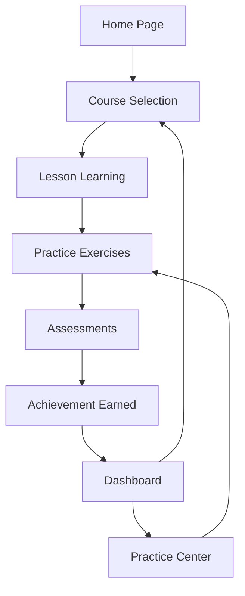

## 1. Product Overview
基于Python的数据分析在线教育平台，专为商务数据分析与应用专业学生设计，提供完整的课程体系和互动式学习体验。
- 解决商务数据分析专业学生缺乏系统化学习资源和实践机会的问题，帮助他们掌握数据分析技能。
- 目标市场为高校商务数据分析专业学生，提供从基础到进阶的完整学习路径。

## 2. Core Features

### 2.1 User Roles
| Role | Registration Method | Core Permissions |
|------|---------------------|------------------|
| Free User | Email registration | Access basic courses, practice exercises, and assessments |
| Premium User | Email registration + Payment | Access all courses, advanced features, and certification |

### 2.2 Feature Module
1. **Home page**: Hero section, course categories, featured courses, learning progress
2. **Course page**: Course details, lessons, practice exercises, assessments
3. **Learning dashboard**: Progress tracking, achievements, recommended courses
4. **Practice center**: Interactive exercises, coding challenges, data analysis projects
5. **Achievement system**: Badges, certificates, leaderboard

### 2.3 Page Details
| Page Name | Module Name | Feature description |
|-----------|-------------|---------------------|
| Home page | Hero section | Showcase platform value proposition, highlight featured courses, and provide quick access to learning dashboard |
| Home page | Course categories | Display different data analysis topics (Python basics, data visualization, business analytics, etc.) |
| Home page | Featured courses | Show popular and recommended courses with ratings and enrollment numbers |
| Home page | Learning progress | Display user's current learning status and next recommended activities |
| Course page | Course details | Course description, prerequisites, learning objectives, instructor information |
| Course page | Lessons | Structured lessons with video content, code examples, and interactive elements |
| Course page | Practice exercises | Hands-on coding exercises, data analysis tasks, and real-world scenarios |
| Course page | Assessments | Quizzes, projects, and exams to test understanding and application |
| Learning dashboard | Progress tracking | Visual representation of course completion, skill development, and learning milestones |
| Learning dashboard | Achievements | Display earned badges, certificates, and progress toward next goals |
| Learning dashboard | Recommended courses | Personalized course recommendations based on learning history and goals |
| Practice center | Interactive exercises | Browser-based coding environment, data analysis tools, and immediate feedback |
| Practice center | Coding challenges | Progressive difficulty levels, time-based challenges, and solution explanations |
| Practice center | Data analysis projects | Real-world business datasets and analysis scenarios to apply learned skills |
| Achievement system | Badges | Earn badges for course completion, skill mastery, and community contributions |
| Achievement system | Certificates | Generate certificates for course completion and skill verification |
| Achievement system | Leaderboard | Compare progress with peers and track ranking based on activity and achievements |

## 3. Core Process
### User Learning Flow
1. User registers and logs in to the platform
2. User explores course categories and selects a course
3. User completes lessons, watches videos, and reads materials
4. User practices skills through interactive exercises and coding challenges
5. User takes assessments to test understanding
6. User earns badges and certificates for achievements
7. User tracks progress and receives personalized recommendations

## 4. User Interface Design
### 4.1 Design Style
- Primary color: #4361ee (Indigo)
- Secondary color: #3a0ca3 (Purple)
- Accent color: #4cc9f0 (Cyan)
- Button style: Rounded corners (8px), subtle shadows, hover effects
- Font: Inter (sans-serif) for body text, Montserrat (sans-serif) for headings
- Font sizes: H1 (24px), H2 (20px), H3 (16px), body (14px)
- Layout style: Card-based design with clean whitespace, responsive grid system
- Icon style: Modern, minimal line icons with consistent stroke weight

### 4.2 Page Design Overview
| Page Name | Module Name | UI Elements |
|-----------|-------------|-------------|
| Home page | Hero section | Gradient background (#4361ee to #3a0ca3), bold headline, call-to-action button, animated data visualization elements |
| Home page | Course categories | Card-based grid with category icons, hover effects, and enrollment numbers |
| Home page | Featured courses | Carousel of course cards with course image, title, instructor, rating, and enrollment count |
| Home page | Learning progress | Circular progress indicators, bar charts, and next activity recommendations |
| Course page | Course details | Hero section with course banner, course title, instructor info, progress bar, and enrollment button |
| Course page | Lessons | Collapsible lesson sections, video player, code snippets with syntax highlighting, and navigation sidebar |
| Course page | Practice exercises | Interactive coding editor, data visualization tools, and real-time feedback |
| Course page | Assessments | Quiz interface with multiple-choice questions, coding challenges, and submission feedback |
| Learning dashboard | Progress tracking | Dashboard with widgets for course progress, skill development, and recent activities |
| Learning dashboard | Achievements | Badge grid with earned and locked badges, certificate previews |
| Learning dashboard | Recommended courses | Personalized course cards with relevance score and "Start Learning" buttons |
| Practice center | Interactive exercises | Code editor with syntax highlighting, run button, output console, and hint system |
| Practice center | Coding challenges | Challenge cards with difficulty indicators, time limits, and leaderboard access |
| Practice center | Data analysis projects | Project description, dataset preview, analysis tools, and submission interface |
| Achievement system | Badges | Badge collection with earned badges highlighted, locked badges grayed out |
| Achievement system | Certificates | Certificate gallery with download options and shareable links |
| Achievement system | Leaderboard | Table with user rank, name, points, and achievements count |

### 4.3 Responsiveness
- Desktop-first design with mobile-adaptive layout
- Breakpoints: 1200px (desktop), 768px (tablet), 480px (mobile)
- Mobile optimizations: Collapsible navigation menu, stacked card layout, touch-friendly buttons
- Touch optimization: Larger tap targets, swipe gestures for carousels, and responsive input fields

### 4.4 3D Scene Guidance
- Not applicable for this project