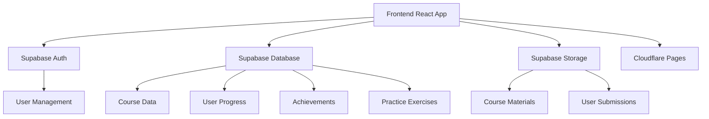
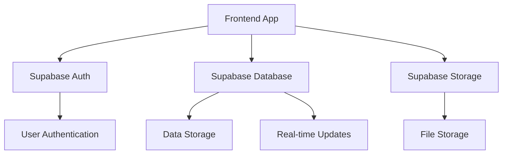
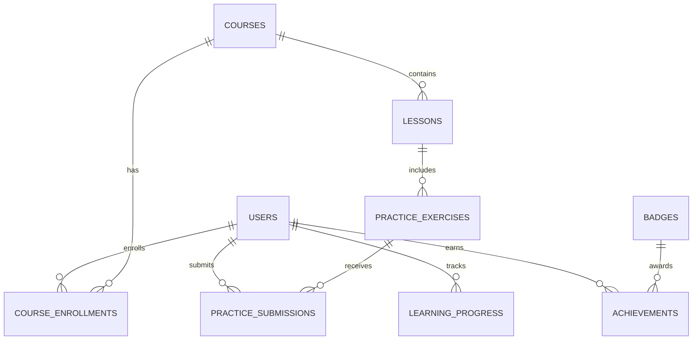

## 1. Architecture Design


## 2. Technology Description
- Frontend: React@18 + TypeScript + Tailwind CSS@3 + Vite
- Initialization Tool: vite-init
- Backend: Supabase (Authentication, Database, Storage)
- Database: Supabase (PostgreSQL)
- Deployment: Cloudflare Pages
- Additional Libraries:
  - React Router DOM for navigation
  - Zustand for state management
  - Lucide React for icons
  - Recharts for data visualization
  - CodeMirror for interactive code editor

## 3. Route Definitions
| Route | Purpose |
|-------|---------|
| / | Home page with course categories and featured courses |
| /dashboard | Learning dashboard with progress tracking and achievements |
| /courses | All courses listing |
| /courses/:id | Course details page with lessons, exercises, and assessments |
| /practice | Practice center with coding exercises and challenges |
| /achievements | Achievement system with badges and certificates |
| /login | User login page |
| /register | User registration page |

## 4. API Definitions
### 4.1 Supabase Client SDK
- Authentication API: User registration, login, password reset
- Database API: CRUD operations for courses, lessons, progress, achievements
- Storage API: Upload and download course materials, user submissions

### 4.2 Custom API Endpoints (if needed)
- Not required for initial implementation. Supabase SDK will handle all backend needs.

## 5. Server Architecture Diagram


## 6. Data Model
### 6.1 Data Model Definition


### 6.2 Data Definition Language
#### Users Table
```sql
CREATE TABLE users (
  id UUID PRIMARY KEY REFERENCES auth.users(id),
  email TEXT UNIQUE NOT NULL,
  name TEXT,
  role TEXT DEFAULT 'free',
  created_at TIMESTAMP WITH TIME ZONE DEFAULT NOW(),
  updated_at TIMESTAMP WITH TIME ZONE DEFAULT NOW()
);

-- Enable Row Level Security
ALTER TABLE users ENABLE ROW LEVEL SECURITY;

-- Create policies
CREATE POLICY "Users can view their own data" ON users
  FOR SELECT USING (auth.uid() = id);

CREATE POLICY "Users can update their own data" ON users
  FOR UPDATE USING (auth.uid() = id);
```

#### Courses Table
```sql
CREATE TABLE courses (
  id SERIAL PRIMARY KEY,
  title TEXT NOT NULL,
  description TEXT,
  category TEXT,
  level TEXT,
  duration INTEGER,
  instructor TEXT,
  image_url TEXT,
  price INTEGER DEFAULT 0,
  is_premium BOOLEAN DEFAULT false,
  created_at TIMESTAMP WITH TIME ZONE DEFAULT NOW(),
  updated_at TIMESTAMP WITH TIME ZONE DEFAULT NOW()
);

-- Enable Row Level Security
ALTER TABLE courses ENABLE ROW LEVEL SECURITY;

-- Create policies
CREATE POLICY "Public can view courses" ON courses
  FOR SELECT USING (true);
```

#### Lessons Table
```sql
CREATE TABLE lessons (
  id SERIAL PRIMARY KEY,
  course_id INTEGER REFERENCES courses(id),
  title TEXT NOT NULL,
  content TEXT,
  video_url TEXT,
  order_index INTEGER,
  is_premium BOOLEAN DEFAULT false,
  created_at TIMESTAMP WITH TIME ZONE DEFAULT NOW(),
  updated_at TIMESTAMP WITH TIME ZONE DEFAULT NOW()
);

-- Enable Row Level Security
ALTER TABLE lessons ENABLE ROW LEVEL SECURITY;

-- Create policies
CREATE POLICY "Public can view free lessons" ON lessons
  FOR SELECT USING (is_premium = false);

CREATE POLICY "Premium users can view all lessons" ON lessons
  FOR SELECT USING (
    is_premium = true AND 
    EXISTS (
      SELECT 1 FROM users 
      WHERE id = auth.uid() AND role = 'premium'
    )
  );
```

#### Practice Exercises Table
```sql
CREATE TABLE practice_exercises (
  id SERIAL PRIMARY KEY,
  lesson_id INTEGER REFERENCES lessons(id),
  title TEXT NOT NULL,
  description TEXT,
  difficulty TEXT,
  instructions TEXT,
  starter_code TEXT,
  solution TEXT,
  is_premium BOOLEAN DEFAULT false,
  created_at TIMESTAMP WITH TIME ZONE DEFAULT NOW(),
  updated_at TIMESTAMP WITH TIME ZONE DEFAULT NOW()
);

-- Enable Row Level Security
ALTER TABLE practice_exercises ENABLE ROW LEVEL SECURITY;

-- Create policies
CREATE POLICY "Public can view free exercises" ON practice_exercises
  FOR SELECT USING (is_premium = false);

CREATE POLICY "Premium users can view all exercises" ON practice_exercises
  FOR SELECT USING (
    is_premium = true AND 
    EXISTS (
      SELECT 1 FROM users 
      WHERE id = auth.uid() AND role = 'premium'
    )
  );
```

#### Course Enrollments Table
```sql
CREATE TABLE course_enrollments (
  id SERIAL PRIMARY KEY,
  user_id UUID REFERENCES users(id),
  course_id INTEGER REFERENCES courses(id),
  enrolled_at TIMESTAMP WITH TIME ZONE DEFAULT NOW(),
  completed_at TIMESTAMP WITH TIME ZONE
);

-- Enable Row Level Security
ALTER TABLE course_enrollments ENABLE ROW LEVEL SECURITY;

-- Create policies
CREATE POLICY "Users can view their own enrollments" ON course_enrollments
  FOR SELECT USING (user_id = auth.uid());

CREATE POLICY "Users can create their own enrollments" ON course_enrollments
  FOR INSERT WITH CHECK (user_id = auth.uid());
```

#### Learning Progress Table
```sql
CREATE TABLE learning_progress (
  id SERIAL PRIMARY KEY,
  user_id UUID REFERENCES users(id),
  lesson_id INTEGER REFERENCES lessons(id),
  completed BOOLEAN DEFAULT false,
  completed_at TIMESTAMP WITH TIME ZONE,
  last_accessed TIMESTAMP WITH TIME ZONE DEFAULT NOW()
);

-- Enable Row Level Security
ALTER TABLE learning_progress ENABLE ROW LEVEL SECURITY;

-- Create policies
CREATE POLICY "Users can view their own progress" ON learning_progress
  FOR SELECT USING (user_id = auth.uid());

CREATE POLICY "Users can update their own progress" ON learning_progress
  FOR UPDATE USING (user_id = auth.uid());

CREATE POLICY "Users can create their own progress" ON learning_progress
  FOR INSERT WITH CHECK (user_id = auth.uid());
```

#### Practice Submissions Table
```sql
CREATE TABLE practice_submissions (
  id SERIAL PRIMARY KEY,
  user_id UUID REFERENCES users(id),
  exercise_id INTEGER REFERENCES practice_exercises(id),
  code TEXT,
  output TEXT,
  is_correct BOOLEAN,
  submitted_at TIMESTAMP WITH TIME ZONE DEFAULT NOW()
);

-- Enable Row Level Security
ALTER TABLE practice_submissions ENABLE ROW LEVEL SECURITY;

-- Create policies
CREATE POLICY "Users can view their own submissions" ON practice_submissions
  FOR SELECT USING (user_id = auth.uid());

CREATE POLICY "Users can create their own submissions" ON practice_submissions
  FOR INSERT WITH CHECK (user_id = auth.uid());
```

#### Badges Table
```sql
CREATE TABLE badges (
  id SERIAL PRIMARY KEY,
  name TEXT NOT NULL,
  description TEXT,
  image_url TEXT,
  condition TEXT,
  points INTEGER DEFAULT 0,
  created_at TIMESTAMP WITH TIME ZONE DEFAULT NOW()
);

-- Enable Row Level Security
ALTER TABLE badges ENABLE ROW LEVEL SECURITY;

-- Create policies
CREATE POLICY "Public can view badges" ON badges
  FOR SELECT USING (true);
```

#### Achievements Table
```sql
CREATE TABLE achievements (
  id SERIAL PRIMARY KEY,
  user_id UUID REFERENCES users(id),
  badge_id INTEGER REFERENCES badges(id),
  earned_at TIMESTAMP WITH TIME ZONE DEFAULT NOW()
);

-- Enable Row Level Security
ALTER TABLE achievements ENABLE ROW LEVEL SECURITY;

-- Create policies
CREATE POLICY "Users can view their own achievements" ON achievements
  FOR SELECT USING (user_id = auth.uid());

CREATE POLICY "Users can create their own achievements" ON achievements
  FOR INSERT WITH CHECK (user_id = auth.uid());
```

#### Initial Data
```sql
-- Insert sample courses
INSERT INTO courses (title, description, category, level, duration, instructor, image_url, price, is_premium) VALUES
('Python基础编程', '学习Python编程语言的基础知识，包括变量、数据类型、控制流等。', '编程基础', '初级', 10, '张教授', 'https://trae-api-cn.mchost.guru/api/ide/v1/text_to_image?prompt=Python%20programming%20basics%20education%20banner&image_size=landscape_16_9', 0, false),
('数据分析入门', '学习数据分析的基本概念和方法，包括数据清洗、数据可视化等。', '数据分析', '初级', 15, '李老师', 'https://trae-api-cn.mchost.guru/api/ide/v1/text_to_image?prompt=Data%20analysis%20intro%20education%20banner&image_size=landscape_16_9', 0, false),
('商务数据分析', '学习如何使用数据分析工具解决商务问题，包括市场分析、客户分析等。', '商务分析', '中级', 20, '王教授', 'https://trae-api-cn.mchost.guru/api/ide/v1/text_to_image?prompt=Business%20data%20analysis%20education%20banner&image_size=landscape_16_9', 99, true),
('Python数据可视化', '学习使用Python库进行数据可视化，包括Matplotlib、Seaborn等。', '数据可视化', '中级', 12, '赵老师', 'https://trae-api-cn.mchost.guru/api/ide/v1/text_to_image?prompt=Python%20data%20visualization%20education%20banner&image_size=landscape_16_9', 49, true);

-- Insert sample lessons
INSERT INTO lessons (course_id, title, content, video_url, order_index, is_premium) VALUES
(1, 'Python简介', 'Python是一种高级编程语言，以其简洁易读的语法而闻名。', NULL, 1, false),
(1, '变量和数据类型', '学习Python中的变量定义和基本数据类型。', NULL, 2, false),
(1, '控制流语句', '学习Python中的条件语句和循环语句。', NULL, 3, false),
(2, '数据分析概述', '了解数据分析的基本概念和工作流程。', NULL, 1, false),
(2, '数据清洗', '学习如何处理和清洗数据。', NULL, 2, false),
(2, '数据可视化基础', '学习数据可视化的基本原理和方法。', NULL, 3, false);

-- Insert sample practice exercises
INSERT INTO practice_exercises (lesson_id, title, description, difficulty, instructions, starter_code, solution, is_premium) VALUES
(1, 'Hello World', '编写一个简单的Python程序，输出"Hello World"。', '简单', '创建一个Python文件，编写代码输出"Hello World"。', 'print("Hello World")', 'print("Hello World")', false),
(2, '变量练习', '创建变量并进行基本运算。', '简单', '创建两个变量，分别赋值为10和5，然后计算它们的和、差、积、商。', 'a = 10\nb = 5\nprint(a + b)\nprint(a - b)\nprint(a * b)\nprint(a / b)', 'a = 10\nb = 5\nprint(a + b)\nprint(a - b)\nprint(a * b)\nprint(a / b)', false),
(4, '数据类型识别', '识别不同类型的数据。', '简单', '分析给定的数据，识别它们的数据类型。', '# 分析以下数据的类型\ndata = [10, "hello", 3.14, True]\nfor item in data:\n    print(type(item))', '# 分析以下数据的类型\ndata = [10, "hello", 3.14, True]\nfor item in data:\n    print(type(item))', false);

-- Insert sample badges
INSERT INTO badges (name, description, image_url, condition, points) VALUES
('Python新手', '完成Python基础课程的第一个练习', 'https://trae-api-cn.mchost.guru/api/ide/v1/text_to_image?prompt=Python%20beginner%20badge%20icon&image_size=square', '完成练习1', 10),
('数据分析入门', '完成数据分析入门课程', 'https://trae-api-cn.mchost.guru/api/ide/v1/text_to_image?prompt=Data%20analysis%20beginner%20badge%20icon&image_size=square', '完成课程2', 20),
('练习达人', '完成10个练习', 'https://trae-api-cn.mchost.guru/api/ide/v1/text_to_image?prompt=Practice%20master%20badge%20icon&image_size=square', '完成10个练习', 30),
('课程完成者', '完成一门完整课程', 'https://trae-api-cn.mchost.guru/api/ide/v1/text_to_image?prompt=Course%20completer%20badge%20icon&image_size=square', '完成一门课程', 50);

-- Grant permissions
GRANT SELECT ON users TO anon;
GRANT ALL PRIVILEGES ON users TO authenticated;

GRANT SELECT ON courses TO anon;
GRANT ALL PRIVILEGES ON courses TO authenticated;

GRANT SELECT ON lessons TO anon;
GRANT ALL PRIVILEGES ON lessons TO authenticated;

GRANT SELECT ON practice_exercises TO anon;
GRANT ALL PRIVILEGES ON practice_exercises TO authenticated;

GRANT SELECT ON course_enrollments TO anon;
GRANT ALL PRIVILEGES ON course_enrollments TO authenticated;

GRANT SELECT ON learning_progress TO anon;
GRANT ALL PRIVILEGES ON learning_progress TO authenticated;

GRANT SELECT ON practice_submissions TO anon;
GRANT ALL PRIVILEGES ON practice_submissions TO authenticated;

GRANT SELECT ON badges TO anon;
GRANT ALL PRIVILEGES ON badges TO authenticated;

GRANT SELECT ON achievements TO anon;
GRANT ALL PRIVILEGES ON achievements TO authenticated;
```